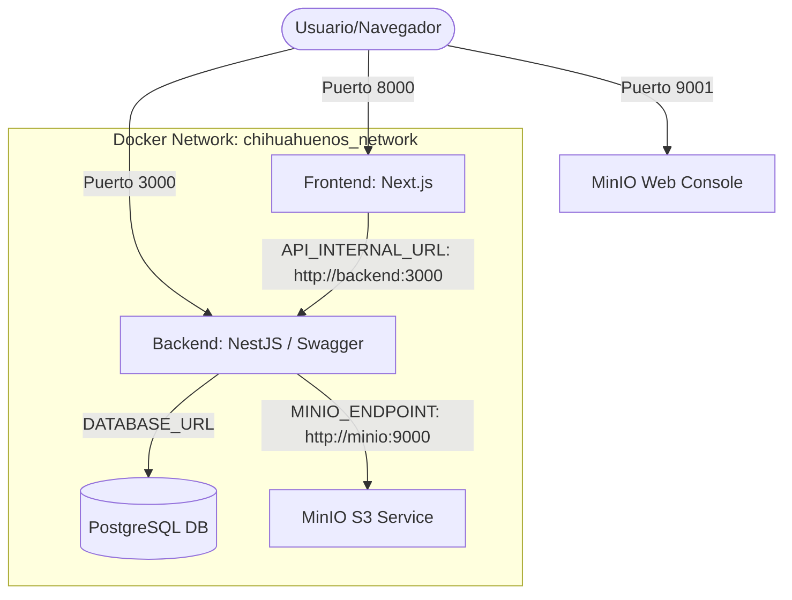

# Chihuahueños S.A. de C.V. - Sistema de Venta de Boletos (MVP)

Este repositorio contiene la plataforma web de venta de boletos de autobús inter-estatal para **Chihuahueños S.A. de C.V.** El sistema está diseñado con un fuerte enfoque en prevenir la sobre-reserva de asientos (condiciones de carrera) y permite la escalabilidad de rutas mediante APIs administradas.

---

## 🛠️ Stack Tecnológico

El proyecto está estructurado como un monorrepo simple y utiliza las siguientes tecnologías:

- **Frontend:** [Next.js 14](https://nextjs.org/) (App Router) en el puerto `8000`.
- **Backend:** [NestJS](https://nestjs.com/) (con OpenAPI/Swagger) en el puerto `3000`.
- **Base de Datos:** [PostgreSQL 15](https://www.postgresql.org/) en el puerto `5432`.
- **Almacenamiento de Archivos:** [MinIO](https://min.io/) (Emulador local de AWS S3) en el puerto `9000` (API) y `9001` (Consola).
- **Orquestación:** Docker y Docker Compose para levantar todo el entorno local de forma unificada.

---

## 📐 Arquitectura y Flujo del Sistema

El siguiente diagrama detalla cómo interactúan los componentes dentro y fuera del entorno de Docker:



---

## 🚀 Cómo Iniciar el Proyecto

### Requisitos Previos

- Docker instalado y ejecutándose en tu máquina.
- Docker Compose v2.0+.

### Instrucciones

1. **Clonar e iniciar el entorno:**
   Desde la raíz del proyecto, ejecuta el siguiente comando para compilar las imágenes e iniciar los contenedores:

   ```bash
   docker compose up --build
   ```

2. **Verificar el estado de los contenedores:**
   Una vez completada la construcción, asegúrate de que todos los servicios estén corriendo correctamente:

   ```bash
   docker compose ps
   ```

3. **Población de Datos Iniciales (Seeds):**
   Al levantar los servicios con Docker Compose, el backend ejecuta automáticamente scripts de "seeding" para inicializar la base de datos:
   - **Administrador:** Se crea el primer usuario administrador con base en las variables del `.env` (`ADMIN_EMAIL`, `ADMIN_PASSWORD`). Valores por defecto: `admin@chihuahuenos.com` / `admin1234`.
   - **Rutas Base:** Se crean automáticamente las siguientes rutas operativas:
     - Oaxaca - Puebla
     - Chihuahua - Nuevo León
     - Baja California Norte - Baja California Sur
     - Chihuahua - CDMX
   - **Viajes Programados:** Se programan 2 viajes por cada ruta existente. Los horarios de salida se fijan para el día siguiente de manera automática (por ejemplo a las 08:00 hrs y a las 16:00 hrs), para que siempre haya viajes disponibles al levantar el proyecto.

---

## 🔌 Puertos y Puntos de Acceso

| Servicio                 | URL Local                                      | Descripción                                                                                       |
| :----------------------- | :--------------------------------------------- | :------------------------------------------------------------------------------------------------ |
| **Frontend (Next.js)**   | [http://localhost:8000](http://localhost:8000) | Interfaz de usuario para clientes (listado de viajes, selección de asientos y checkout).          |
| **Backend (NestJS API)** | [http://localhost:3000](http://localhost:3000) | API REST principal. La documentación interactiva está disponible en `/api` (si está configurada). |
| **MinIO Consola Web**    | [http://localhost:9001](http://localhost:9001) | Panel de administración web para gestionar buckets y archivos.                                    |
| **MinIO API S3**         | [http://localhost:9000](http://localhost:9000) | Endpoint para la carga de archivos por parte del backend.                                         |
| **PostgreSQL**           | `localhost:5432`                               | Conexión directa a la base de datos local.                                                        |

---

## 🔒 MVP e Implementación Técnica

### 1. Control de Concurrencia (Crítico)

Para evitar que dos usuarios compren el mismo asiento simultáneamente:

- Al seleccionar un asiento, el backend NestJS ejecutará una transacción SQL utilizando un bloqueo a nivel de fila mediante `SELECT ... FOR UPDATE` en PostgreSQL.
- El asiento cambiará su estado a `reservado` con un tiempo de expiración: `bloqueado_hasta = NOW() + 10 minutos`.
- Cualquier consulta de disponibilidad excluirá los asientos reservados que tengan un `bloqueado_hasta` mayor al tiempo actual.

### 2. Carga de Identificaciones (MinIO)

- Durante el registro del usuario, el usuario subirá un archivo de identificación (PDF, JPG, PNG; max 5MB).
- El backend recibe el buffer (a través de un `FileInterceptor`) y lo sube directamente al bucket `identificaciones` en MinIO.

---

## 📁 Estructura del Directorio

```text
chihuahuenios/
├── backend/            # Aplicación NestJS (API & Base de Datos)
│   ├── src/            # Código fuente del backend
│   └── package.json
├── frontend/           # Aplicación Next.js 14 (Interfaz Web)
│   ├── src/            # Código fuente del frontend (App Router)
│   └── package.json
├── docker-compose.yml  # Configuración de Orquestación Docker
└── README.md           # Este archivo de documentación
```
